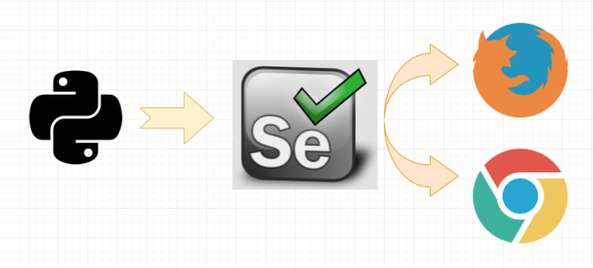
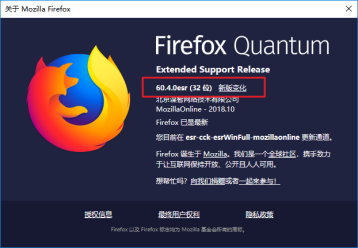
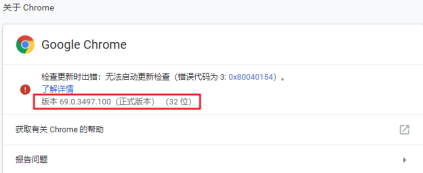
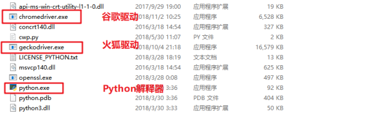

> Selenium采集数据

​		Selenium 是一个用于Web应用程序测试的工具。Selenium测试直接运行在浏览器中，就像真正的用户在操作一样。支持的浏览器包括IE（7, 8, 9, 10, 11），[Mozilla Chrome](https://baike.baidu.com/item/Mozilla Chrome/3504923)，Safari，Google Chrome，Opera等。

## 1、动态网页&静态网页

​		静态网页是指存放在服务器文件系统中实实在在的HTML文件。当用户在浏览器中输入页面的URL，然后回车，浏览器就会将对应的HTML文件下载、渲染并呈现在窗口中。早期的网站通常都是由静态页面制作的。

### 1、1 动态网页

​		动态网页是相对于静态网页而言的。当浏览器请求服务器的某个页面时，服务器根据当前时间、环境参数、数据库操作等动态的生成HTML页面，然后在发送给浏览器（后面的处理就跟静态网页一样了）。

​		很明显，动态网页中的“动态”是指服务器端页面的动态生成，相反，“静态”则指页面是实实在在的、独立的文件。

**注意：** 

* 动态页面技术是与 [静态页面](https://baike.baidu.com/item/%E9%9D%99%E6%80%81%E9%A1%B5%E9%9D%A2) 技术相对应的，也就是说，网页URL的后缀不是 .htm、.html、.shtml、.xml 等静态网页的常见形式，而是以 .asp、.jsp、.php、.perl、.cgi 等形式为后缀，并且在 [**动态网页**](https://baike.baidu.com/item/%E5%8A%A8%E6%80%81%E7%BD%91%E9%A1%B5)  网址中有一个标志性的符号——“？”。

* 这里说的 [动态网页](https://baike.baidu.com/item/%E5%8A%A8%E6%80%81%E7%BD%91%E9%A1%B5) ，与网页上的各种动画、滚动字幕等视觉上的“动态效果”没有直接关系，动态网页也可以是纯文字内容的，也可以是包含各种动画的内容，这些只是网页具体内容的表现形式，无论网页是否具有动态效果，采用动态网站技术生成的网页都称为动态网页。

#### 1、1、1 JavaScript

​		JavaScript是一种属于网络的脚本语言，已经被广泛用于Web应用开发，常用来为网页添加各式各样的动态功能，为用户提供更流畅美观的浏览效果。通常JavaScript脚本是通过嵌入在HTML中来实现自身的功能的。

可以在网页源代码的<scripy>标签里看到，比如：

```html
<script type="text/javascript" src="https://statics.huxiu.com/w/mini/static_2015/js/sea.js?v=201601150944"></script>
```

​		JavaScript可以动态地创建HTML内容，这些内容只有在JavaScript代码执行之后才会产生和显示如果使用传统的方法采集页面内容，就只能获得JavaScript代码执行之前页面上的内容。

**JQuery** 

​		JQuery是一个快速、简洁的JavaScript框架，它封装JavaScript常用的功能代码，提供一种简便的JavaScript设计模式，优化HTML文档操作、事件处理、动画设计和Ajax交互。一个网站使用 JQuery 的特征， 就是源代码里包含了 JQuery 入口，比如:

```html
<script type="text/javascript" src="https://statics.huxiu.com/w/mini/static_2015/js/jquery-1.11.1.min.js?v=201512181512"></script>
```

​		如果一个网站网页源码中出现了 jQuery，那么采集这个网站数据的时候要格外小心。因为jQuery可以动态地创建HTML内容，这些内容只有在JavaScript代码执行之后才会产生和显示。如果使用传统的方法采集页面内容，就只能获得JavaScript代码执行之前页面上的内容。

#### 1、1、2 Ajax

​		使用Ajax技术更新网页的内容的网站有个很大的特点，那就是可以**在不重新加载整个网页的情况下，对网页的某部分进行更新。**

​		Ajax其实并不是一门语言，而是用来完成网络任务(可以认为它与网络数据采集差不多)的一系列技术。Ajax网站不需要使用整个的页面加载就可以和网络服务器进行交互。

#### 1、1、3 DHTML

​		DHTML: Dynamic HTML 动态的HTML， 这门技术并不是一门新的技术， 而是将之前所学的HTML、CSS、JavaScript整合在一起，利用JS操作页面元素， 让元素具有动态的变化， 使得页面和用户具有交互的行为。

### 1、2 动态网页处理方法

使用动态加载的网站，用 Python 解决有如下几种途径:

1. 直接破解 `JavaScript` 代码里采集内容。
2. 抓包分析，查看截图的请求响应信息，伪造请求，实现响应的获取。(推荐)
3. 用 Python 的 第三方库运行 JavaScript，直接采集你在浏览器里看到的页面。(推荐)

**既然浏览器能拿到数据，那么，可以模拟一个浏览器，从浏览器中拿到数据。也就是用程序控制浏览器，从而达到数据采集的目的。** 

## 2、Selenium

​		Selenium 是一个 Web 的自动化测试工具，最初是为网站自动化测试而开发的，就像玩游戏用的按键精灵，可以按指定的命令自动操作。

​		Selenium 测试工具直接操控浏览器中，就像真正的用户在操作一样。Selenium 可以根据的指令，让浏览器自动加载页面，获取需要的数据，甚至页面截屏，或者判断网站上某些动作是否发生等。

### 2、1 Selenium工作原理



​		如图所示，通过 Python 来控制 Selenium，然后让 Selenium 控制浏览器，操纵浏览器，这样就实现了使用Python 间接的操控浏览器。

### 2.1.1 Selenium配置

​		Selenium 支持多种浏览器，最常见的就是 **火狐** 和 **谷歌** 浏览器。首先在电脑上下载浏览器，浏览器版本不宜过新。

**火狐：截图如下**



**谷歌：截图如下**



#### 2、1、2 浏览器驱动

​		Selenium具体怎么就能操纵浏览器呢？这要归功于 **浏览器驱动** ，Selenium可以通过API接口实现和浏览器驱动的交互，进而实现和浏览器的交互。所以要配置浏览器驱动。

**火狐驱动下载地址：** http://npm.taobao.org/mirrors/geckodriver/

**谷歌驱动下载地址：**https://npm.taobao.org/mirrors/chromedriver/

* 配置浏览器驱动：

  * 将下载好的浏览器驱动解压，将解压出的 `exe` 文件放到Python的安装目录下，也就是和`python.exe`同目录即可。



#### 2、1、3 使用Selenium

**安装selenium模块，python借助这个模块驱动浏览器，使用如下命令行安装这个模块即可**

```
pip install selenium
```

### 2、2 快速入门

```python
'''
	打开百度首页
'''
from selenium import webdriver

driver = webdriver.Chrome()
url = 'https://www.baidu.com/'
driver.get(url)
# 打开 get 就类似与在浏览器地址栏里面放入网址
driver.get(url)
# 退出浏览器
driver.quit()
```

## 3、浏览器对象的常用方法

当我们通过selenium实例化一个浏览器对象时，可以针对此对象进行操作，常见的操作如下所示：

* driver.get('url')
  根据url地址访问站点
* driver.page_source
  查看页面渲染之后的html数据
* driver.get_cookies()
  查看页面请求后生成的cookies，可以用此方法拿到加密的cookies
* driver.current_url
  查看当前页面的url
* driver.maximize_window()
  最大化浏览器
* driver.minimize_window()
  最小化浏览器
* driver.close()
  关闭当前页面，注意不是关闭整个浏览器
* driver.quit()
  关闭浏览器

## 4、元素提取

通过selenium的基本使用可以简单定位元素和获取对应的数据,接下来我们再来学习下定位元素的方法

~~~python
find_element(By.ID, 'id属性值') # (根据id属性值获取元素)
find_element(By.NAME, 'name属性值') # (根据标签的name属性)
find_element(By.CLASS_NAME, '类属性值') #（根据类名获取元素）
find_element(By.LINK_TEXT, '标签文本') #（根据标签的文本获取元素，精确定位）
find_element(By.PARTIAL_LINK_TEXT, '标签文本') #（根据标签包含的文本获取元素，模糊定位）
find_element(By.TAG_NAME, '标签名') #(根据标签名获取元素)
find_element(By.XPATH, 'xpath语法') #（根据xpath获取元素）
find_element(By.CSS_SELECTOR, 'css语法') # (根据css选择器获取元素)
~~~

上述方法只能查找页面某个标签元素，如果想获取多个元素可以在 **element** 后加字母 s ，如下所示：

~~~python
find_elements(By.ID, 'anony-nav') # (根据id属性值获取元素,返回一个list列表)
find_elements(By.NAME, 'name属性值')  # (根据标签的name属性,返回一个list列表)
find_elements(By.CLASS_NAME, '类属性值') #（根据类名获取元素,,返回一个list列表）
find_elements(By.LINK_TEXT, '标签文本') #（根据标签的文本获取元素，精确定位,返回一个list列表）
find_elements(By.PARTIAL_LINK_TEXT, '标签文本') #（根据标签包含的文本获取元素，模糊定位,返回一个list列表）
find_elements(By.TAG_NAME, '标签名') #(根据标签名获取元素,返回一个list列表)
find_elements(By.XPATH, '//*[@id="douban-logo"]/a') #（根据xpath获取元素,返回一个list列表）
find_elements(By.CSS_SELECTOR, 'css语法') # (根据css选择器获取元素,返回一个list列表)
~~~

**案例：**以豆瓣首页为例:https://www.douban.com/

~~~python
# 导入模块
from selenium.webdriver.common.by import By  # 定位器功能
from selenium import webdriver

# 1.创建浏览器对象
driver = webdriver.Chrome()

# 2.发送请求
driver.get('https://www.douban.com/')

# 3.解析数据   根据这些方法提取出来的标签都是 selenium.webdriver.remote.webelement.WebElement 对象
# 3.1 根据标签的 id 值获取标签
result1 = driver.find_element(By.ID, 'anony-nav')
print(result1)

# 3.2 根据标签的 name 属性值获取标签
result2 = driver.find_element(By.NAME, 'description')
print(result2)

# 3.3 根据标签的 class 属性值获取标签
result3 = driver.find_element(By.CLASS_NAME, 'site-name')
print(result3)

# 3.4 根据标签包含的文本内容获取标签(精确匹配)
result4 = driver.find_element(By.LINK_TEXT, '下载豆瓣 App')
print(result4)

# 3.5 根据标签包含的文本内容获取标签(模糊匹配)
result5 = driver.find_element(By.PARTIAL_LINK_TEXT, '豆瓣')
print(result5)

# 3.6 根据标签的名字获取标签
print('* ' * 100)
result6 = driver.find_elements(By.TAG_NAME, 'div')
print(result6)
print(len(result6))

# 3.7 根据css选择器获取标签
result7 = driver.find_element(By.CSS_SELECTOR, '#douban-logo > a')
print(result7)

# 3.8 根据xpath获取标签
result8 = driver.find_element(By.XPATH, '//*[@id="douban-logo"]/a')
print(result8)


input()
driver.quit()
~~~

一般提取到页面元素，无非就是获取元素包含的文本内容或者元素的属性值，当你通过上述元素提取的方法获取元素以后，可以通过如下方法及属性，获取元素包含的文本以及元素指定的属性值：

~~~python
send_keys('需要在输入框输入的字符串') # 向输入框输入数据
click() # 执行点击操作
text # 获取元素包含的文本内容
get_attribute('属性名') # 获取元素的属性值
~~~

案例如下：

~~~python
from selenium import webdriver
from selenium.webdriver.common.by import By  # 定位器功能


driver = webdriver.Chrome()
driver.get('https://www.douban.com/')

"""
text    属性, 可以提取标签包含的文本内容, 支持链式调用

        使用css选择器和xpath方法提取出来的标签不支持属性选择器和直接获取标签包含的文本内容
"""
result7 = driver.find_element(By.CSS_SELECTOR, '#douban-logo > a')
print(result7)

"""
get_attribute() 
    方法, 可以根据属性名提取该标签对应属性名的值, 支持链式调用
"""
result7 = driver.find_element(By.CSS_SELECTOR, '#douban-logo > a').get_attribute('href')
print(result7)

# 找到的元素是输入框
"""
send_keys('需要在输入框中输入的字符串') 
    向输入框中输入数据, 支持链式调用
"""
result = driver.find_element(By.CSS_SELECTOR, '.anony-srh .inp>input').send_keys('肖申克的救赎')

"""
click()   执行标签的点击操作, 需要改标签具有点击事件
"""
result2 = driver.find_element(By.CSS_SELECTOR, '.bn').click()
# result2.click()

input()
driver.quit()

~~~

## 5、页面等待的方法

​		现在的网页越来越多采用了 Ajax 技术，这样程序便不能确定何时某个元素完全加载出来了。如果实际页面等待时间过短导致某个dom元素还没出来，但是你的代码直接使用了这个WebElement，那么就会抛出ElementNotVisibleException的异常。

​		为了避免这种元素定位困难而且会提高产生 ElementNotVisibleException 的概率。所以 Selenium 提供了如下等待方式：

* 一种是隐式等待
* 一种是强制等待

​	    隐式等待比较简单，就是简单地设置一个等待时间，单位为秒。隐式等待是等页面加载完毕，而不是元素加载！！！（隐式等待就是针对页面的，显式等待是针对元素的。）

~~~python
"""
time.sleep(5) 强制等待
隐式等待不是一个死等
"""
from selenium import webdriver


driver = webdriver.Chrome(executable_path='chromedriver.exe')
driver.get('https://www.jd.com/')

# 隐式等待, 括号里面设置等待的时间, 一旦页面早就完成了渲染, 那么就不会等待(单位秒)
# 超过隐式等待时间还是会报错
driver.implicitly_wait(10)

driver.quit()
~~~

>隐式等待只需设置一次，后面的代码都遵循这个规则，不像time.sleep 。time.sleep 属于强
>制等待。

​		强制等待就是死等，设置一个时间阈值，如果在这个时间内渲染完数据，接下来你想获取元素等页面数据，用上述元素提取的方法才不会报错。反之页面数据还没有渲染完数据，你要提取没有渲染完的数据程序就会报错。

## 6、浏览器对象的其他方法

除了上述浏览器对象的常用方法以外，还有一些基本操作，如下所示：

* driver.back()
  回退到上一级页面

* driver.forward()
  前进到下一级页面

* switch_to（）

  切换窗口以及嵌套网页

## 爬虫，反爬虫，反反爬虫(了解)

### 第一天

- 小源看到某网站的电影不错，想要该网站上所有的电影，写了一个简单的爬虫(基于requests库)，使用循环，不断地遍历该网站的电影列表页面，根据 Html 分析电影名字，资源链接等存进自己的**数据库**。
- 这个站点的运维小码打开电脑日志发现某个时间段请求量陡增，以为自己网站要“火”，分析日志发现都是 IP(xxx.xxx.xxx.xxx)这个用户，并且 **User-Agent** 还是 python-requests/2.18.4 ，基于这两点判断非人类后直接在服务器上封杀，永久封禁该IP地址。

### 第二天

- 小源早上起来后发现自己的小爬虫不能得到数据了，返回的都是错误提示。而且在浏览器中页发现这个电影网站不能打开了，于是想到了，该网站对自己实行了封禁。于是也针对性的变换了下策略：

1. ser-Agent 模仿百度("**Baiduspider**...") --> 或者随机替换请求头（使用fake_useragent模块）
2. IP每爬半个小时就换一个IP代理。

- 小码也发现了对应的变化，于是在服务器上设置了一个频率限制，每分钟超过120次请求的再屏蔽IP。 同时考虑到百度家的爬虫有可能会被误伤，想想市场部门每月几十万的投放，于是写了个脚本，通过 hostname 检查下这个 ip 是不是真的百度家的，对这些 IP 设置一个白名单。

### 第三天

- 小源发现了新的限制后，想着我也不急着要这些数据，留给服务器慢慢爬吧，于是修改了代码，随机1-3秒爬一次（time.sleep， random模块），爬10次休息10秒，每天只在8-12，18-20点爬，隔几天还休息一下。
- 小码看着新的日志头都大了，再设定规则不小心会误伤(率)真实用户，于是准备换了一个思路，当3个小时的总请求超过50次的时候弹出一个验证码弹框，没有准确正确输入的话就把 IP 记录进黑名单。

### 第四天

- 小源看到验证码有些傻脸了，不过也不是没有办法，先去学习了图像识别（关键词 PIL,tesseract），再对验证码进行了二值化，分词，模式训练之后，总之最后识别了小码的验证码（关于验证码，验证码的识别，验证码的反识别也是一个恢弘壮丽的斗争史...），之后爬虫又跑了起来。
- 小码是个不折不挠的好同学，看到验证码被攻破后，和开发同学商量了变化下开发模式，数据并不再直接渲染，而是由前端同学异步获取，并且通过 JavaScript 的加密库生成动态的 token，同时加密库再进行混淆（比较重要的步骤的确有网站这样做，参见淘宝和微博的登陆流程）。

### 第五天

- 混淆过的加密库就没有办法了么？当然不是，可以慢他放弃了基于 HttpClient的爬虫慢调试，找到加密原理，不过小源不准备用这么耗时耗力的方法，，选择了内置浏览器引擎的爬虫(关键词：PhantomJS,Selenium)，使用Python代码操控浏览器，在浏览器引擎运行页面，直接获取了正确的结果，又一次拿到了对方的数据。
- 小码：.....

