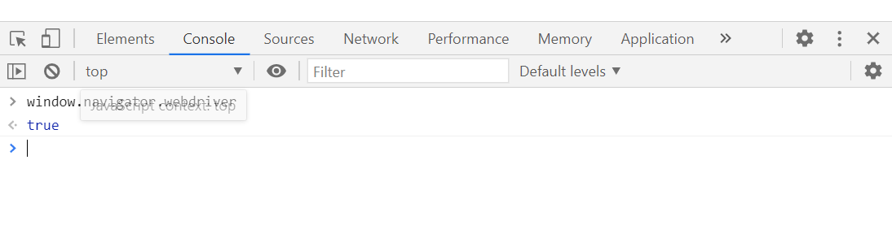

>上述我们学习了selenium入门的一些操作, 本节知识点学习一些selenium的高级用法

## 1、嵌套网页

​		在前端开发中如果有这么一个需求。一个页面上的内容要被其它页面所共用。也就是说两个或者两个以上的页面需要共同存在与同一个页面。在前端页面开发中可以把写好的代码在每个页面中都复制粘贴一份，但一是增加了代码的体积，二是不好进行维护。
​		一个页面上的内容要被其它页面所共用，虽然你可以把写好的代码在每个页面中都复制粘贴一份，但一是增加了代码的体积，二是不好进行维护。
​		所以，更好的做法是把其它页面在需要时引入进来。比如我的H5页面头和底都是固定的，以此先做一个主页面。当用户在点击不同的链接或按钮后，把其它一个或多个页面嵌套在主页面中就可以解决前面提到的问题。

### 1、1 什么是嵌套页面

​		嵌套页面就是在一个HTML页面中嵌套了子页面，常见的网页嵌套的形式在HTML中对应的是标签。

**嵌套页面图解：**

**嵌套页面在HTML源代码的表现形式：**

在我们使用selenium操作此类网页的时候一定需要注意你所操作的页面是不是在嵌套页面。

### 1、2 selenium获取嵌套页面的数据

​		使用selenium获取嵌套页面的数据，首先我们一定要进入到嵌套页面里面，不然是获取不到数据的。进入嵌套页面可以使用实例化浏览器对象的 switch_to.frame() 方法。此方法有两种实现方式，如下所示：

* 根据索引值进入嵌套页面
* 根据标签进入嵌套页面

**案例：**

~~~python
from selenium import webdriver
from selenium.webdriver.common.by import By

driver = webdriver.Chrome()
driver.get('https://music.163.com/#/song?id=1450083773')

"""进图嵌套网页的方式有两种"""
driver.switch_to.frame(0)
print(driver.page_source)

iframe = driver.find_element(By.CSS_SELECTOR, '#g_iframe')
driver.switch_to.frame(iframe)
print(driver.page_source)

input()
driver.quit()
~~~

## 2、执行JavaScript代码

​		在使用selenium操作网页时，有的网页需要滚动鼠标滚轮下拉页面，才会给我们加载页面的下部分数据。众所周知 JavaScript 可以直接在浏览器中运行，那么这样的操作可以让selenium执行**JavaScript**代码来完成。方法如下：

* **execute_script('js代码')：**

  ~~~python
  from selenium import webdriver
  import time
  
  driver = webdriver.Chrome()
  driver.get('https://www.douban.com/')
  
  js = 'document.documentElement.scrollTop=2000'
  js_all = 'document.documentElement.scrollTop = document.documentElement.scrollHeight'
  
  driver.execute_script(js_all)
  
  input()
  driver.quit()
  ~~~

  >注意：对于含有的嵌套网页也需要先嵌套网页才可以下拉。

## 3、鼠标动作链

​		有些时候，需要在页面上模拟一些鼠标操作，比如双击、右击、拖拽甚至按住不动等，可以通过导入 ActionChains 类来做到：http://www.runoob.com/try/try.php?filename=jqueryui-api-droppable
比如：

~~~python
"""
拖动鼠标:
	ActionChains:
		ActionChains() --> 直接传入driver --> ActionChains(driver) 实例化
		perform --> 执行动作
		drag_and_drop(source， target) source拖动的元素 target元素被放置的位置
"""
from selenium import webdriver
from selenium.webdriver.common.by import By
from selenium.webdriver import ActionChains  # 导入鼠标动作链功能

driver = webdriver.Chrome()
driver.get('https://www.runoob.com/try/try.php?filename=jqueryui-api-droppable')

driver.switch_to.frame(0)

drag = driver.find_element(By.CSS_SELECTOR, '#draggable')
drop = driver.find_element(By.CSS_SELECTOR, '#droppable')

action = ActionChains(driver)

action.drag_and_drop(drag, drop)

action.perform()

input()
driver.quit()
"""
注意:
	perform才是真正的执行 可以在perform之前定义多个动作 最后一起执行
	注意切入框内
"""
~~~

鼠标操作有如下的方法：

* click()
  单击指定的元素。如果没有，则单击当前鼠标位置。
* click_and_hold(）
  按住元素上的鼠标左键，并保持。
* context_click()
  对元素执行上下文单击(右键单击)
* double_click()
  双击一个元素

## 4、selenium键盘事件

​		除了上述的selenium操作之外，键盘事件也是非常重要的，比如我们需要按回车键，ctrl+c复制等等操作，都离不开键盘事件，在selenium中，提供了Keys方法来供我们操作键盘。

首先必须先引用selenium中**keys**包：

~~~python
from selenium.webdriver.common.keys import Keys
~~~

Key()类几乎提供所有按键的方法：

| 引用方法                    | 对应键盘            |
| --------------------------- | ------------------- |
| send_keys(Keys.BACK_SPACE)  | 删除键（BackSpace） |
| send_keys(Keys.SPACE)       | 空格键(Space)       |
| send_keys(Keys.TAB)         | 制表键(Tab)         |
| send_keys(Keys.ESCAPE)      | 回退键（Esc）       |
| send_keys(Keys.ENTER)       | 回车键（Enter）     |
| send_keys(Keys.CONTROL,'a') | 全选（Ctrl+A）      |
| send_keys(Keys.CONTROL,'c') | 复制（Ctrl+C）      |
| send_keys(Keys.CONTROL,'x') | 剪切（Ctrl+X）      |
| send_keys(Keys.CONTROL,'v') | 粘贴（Ctrl+V）      |
| send_keys(Keys.F1)          | 键盘 F1             |
| send_keys(Keys.F12)         | 键盘 F12            |

>需要注意的是键盘事件用send_keys()方法
>
>而且selenium所有的send_keys()方法都是基于元素操作的，没有元素无法操作。

**案例:**

~~~python
from selenium import webdriver
from selenium.webdriver.common.keys import Keys
import time

# 在百度搜索框输入 python ，全选,复制,剪切,粘贴 跳转到搜狗输入框进行搜索
driver = webdriver.Chrome()
driver.get('https://www.baidu.com')

driver.find_element(By.CSS_SELECTOR, '#kw').send_keys('python')
time.sleep(3)

driver.find_element(By.CSS_SELECTOR, '#kw').send_keys(Keys.CONTROL, 'a')  # 全选
time.sleep(3)

driver.find_element(By.CSS_SELECTOR, '#kw').send_keys(Keys.CONTROL, 'c')  # 复制
time.sleep(3)

driver.find_element(By.CSS_SELECTOR, '#kw').send_keys(Keys.CONTROL, 'x')  # 剪切
time.sleep(3)

driver.get('https://www.sogou.com/')
driver.find_element(By.CSS_SELECTOR, '#query').send_keys(Keys.CONTROL, 'v')  # 粘贴
time.sleep(4)

driver.find_element(By.CSS_SELECTOR, '#stb').send_keys(Keys.ENTER)

input()
driver.quit()
~~~

## 5、其他方法

### 5、1 选择下拉框

​		有时候会碰到标签的下拉框。直接点击下拉框中的选项不一定可行。Selenium专门提供了Select类来处理下拉框。 其实 WebDriver 中提供了一个叫 Select 的方法，可以帮助完成这些事情。如下案例所示：

~~~python
from selenium import webdriver
from selenium.webdriver.common.by import By
from selenium.webdriver.support.select import Select
import time

driver = webdriver.Chrome()
driver.get('https://www.jq22.com/demo/shengshiliandong/')
driver.implicitly_wait(10)

element = driver.find_element(By.CSS_SELECTOR, '#s_province')

select = Select(element)
time.sleep(3)

"""选择下拉框的方法"""
# 根据索引取下拉框, 从1开始
select.select_by_index(1) 
time.sleep(3)

# 根据下拉框的 value 取值
select.select_by_value('河北省') 
time.sleep(3)

# 根据下拉框标签的文本取下拉框
select.select_by_visible_text('吉林省')  
time.sleep(3)

input()
driver.quit()
'''
下拉框:
	Select(element) element是下拉框的元素
	选择的方法:
		1. select_by_value(value) value="天津市"
		2. select_by_index(1) 通过索引 1 2 3 4 5 6
		3. select_by_visible_text(text) 通过可见的文本
'''
~~~

### 5、2 弹窗的处理

当你触发了某个事件之后，页面出现了弹窗提示，处理这个提示或者获取提示信息方法如下：

* `driver.switch_to_alert()`
  切换到弹窗
* `accept()`
  接受可用的弹窗,相当于点击“确认”
* `dismiss()`
  解除可用的弹窗,相当于点击“取消”
* `text`
  获取弹窗的文本

~~~python
from selenium import webdriver
from selenium.webdriver import ActionChains 
from selenium.webdriver.common.by import By

driver = webdriver.Chrome()
driver.get('https://www.runoob.com/try/try.php?filename=jqueryui-api-droppable')

driver.switch_to.frame(0)
drag = driver.find_element(By.CSS_SELECTOR, '#draggable')
drop = driver.find_element(By.CSS_SELECTOR, '#droppable')
action = ActionChains(driver)
action.drag_and_drop(drag, drop)
action.perform()

# 处理弹窗
"""
switch_to_alert  切换到弹窗(alert是property方法，以属性方式使用，不用调用的方式'（））
text 获取弹窗的文本
accept() 接受可用的弹窗,相当于点击“确认”
dismiss() 解除可用的弹窗,相当于点击“取消”
"""
alert = driver.switch_to.alert 
print(alert.text) 
# alert.accept() 
alert.dismiss() 

input()
driver.quit()
~~~

## 6、selenium设置无头模式

​		总所周知，平时使用selenium做web自动化，运行代码的时候都会打开浏览器驱动访问界面。那么有没有什么方式可以实现无界面运行，让我们在调试代码的时候可以屏蔽界面，去做其他事情呢，答案是有的！

​		在创建浏览器对象之前加上以下添加以下可选项，就能实现无界面运行了。

~~~python
from selenium import webdriver
from selenium.webdriver.chrome.options import Options

chrome_options = Options()  # 声明一个谷歌配置对象
chrome_options.add_argument('--headless')  # 添加 无头模式 配置

# 创建浏览器对象的时候添加配置
driver = webdriver.Chrome(options=chrome_options)
driver.get('https://www.baidu.com')

~~~

## 7、selenium应对检测

​		selenium是用来完成浏览器自动化相关的操作。可以通过代码的形式制定一些基于浏览器自动化的相关操作(行为动作)。当代码执行后，浏览器就会自动触发相关的事件。

​		但这并不能避免服务器的检测。当在浏览器中打开开发者工具输入`window.navigator.webdriver`时会显示true：

说明被服务器检测到了，通常情况下会显示undefined。下面我们就通过对selenium进行设置，避免被检测。

* Selenium执行cdp命令

  Chrome自带的开发者工具DevTools功能非常强大。基本上都是给浏览器开发人员用的工具。我们只需要学习用工具修改`window.navigator.webdriver`的值就可以了。

  * Selenium的WebDriver类中有一个`execute_cdp_cmd(self, cmd, cmd_args)`方法可以用来执行Chrome开发这个工具命令。

    ~~~python
    driver.execute_cdp_cmd("Page.addScriptToEvaluateOnNewDocument", {
      "source": """
        Object.defineProperty(navigator, 'webdriver', {
          get: () => undefined
        })
      """
    })
    ~~~

## 小结

* 浏览器对象的方法及属性
  * driver.get('url') 根据url地址访问站点
  * driver.page_source 查看页面渲染之后的html数据
  * driver.get_cookies() 查看页面请求后生成的cookies，可以用此方法拿到加密的cookies
  * driver.current_url 查看当前页面的url
  * driver.maximize_window() 最大化浏览器
  * driver.minimize_window() 最小化浏览器
  * driver.close() 关闭当前页面，注意不是关闭整个浏览器
  * driver.quit() 关闭浏览器
  * driver.implicitly_wait() 隐式等待
  * driver.back() 回退到上一级页面
  * driver.forward() 前进到下一级页面
  * driver.switch_to.window() 切换窗口
  * driver.switch_to.frame() 切换嵌套网页
  * driver.execute_script() 执行js
  * driver.switch_to_alert() 切换弹窗

* 元素提取的方法及属性(提取多个标签用elements即可)
  * find_element_by_id # (根据id属性值获取标签元素元素)
  * find_element_by_name # (根据标签的name属性获取标签元素元素)
  * find_element_by_class_name #（根据类名获取标签元素）
  * find_element_by_link_text #（根据标签的文本获取标签元素，精确定位）
  * find_element_by_partial_link_text #（根据标签包含的文本获取标签元素，模糊定位）
  * find_element_by_tag_name #(根据标签名获取标签元素)
  * find_element_by_xpath #（根据xpath获取标签元素）
  * find_element_by_css_selector # (根据css选择器获取标签元素)
  * send_keys('需要在输入框输入的字符串') # 向输入框输入数据
  * click() # 执行点击操作
  * text # 获取标签元素包含的文本内容
  * get_attribute('属性名') # 获取标签元素的属性值
  * send_keys(Keys.CONTROL,'a') # 键盘事件