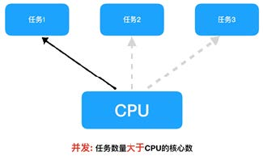
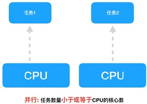
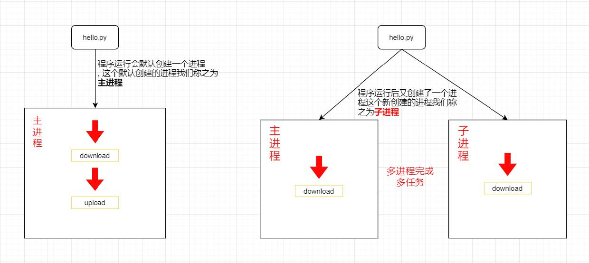
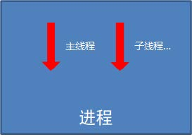

## 一、什么是多任务？

​		什么叫“多任务”呢？简单地说，就是操作系统可以同时运行多个任务。打个比方，你一边在用浏览器上网，一边在听MP3，一边在用Word赶作业，这就是多任务，至少同时v有3个任务正在运行。还有很多任务悄悄地在后台同时运行着，只是桌面上没有显示而已。


在了解多任务具体实现方式之前，我们先来了解并发和并行的概念：

* 并发：在一段时间内交替去执行多个任务。

  对于单核cpu处理多任务,操作系统轮流让各个任务交替执行，假如:软件1执行0.01秒，切换到软件2，软件2执行0.01秒，再切换到软件3，执行0.01秒……这样反复执行下去 , 实际上每个软件都是交替执行的 . 但是，由于CPU的执行速度实在是太快了，表面上我们感觉就像这些软件都在同时执行一样 . 这里需要注意单核cpu是并发的执行多任务的。

  

  最直观的就是如下图所示:

  

* 并行：在一段时间内 **真正的同时一起** 执行多个任务。

  对于多核cpu处理多任务，操作系统会给cpu的每个内核安排一个执行的任务，多个内核是真正的一起同时执行多个任务 。这里需要注意多核cpu是并行的执行多任务，始终有多个任务一起执行。

  

  其实并发和并行就是多任务具体的实现方式：**多线程** 和 **多进程**

  * 并发可以理解为一件事情由多个人同时去做，相当于我雇佣了很多个工具人帮我抢着做事。对应的在程序中我们可以这么理解：当程序发生阻塞导致程序挂起时，我们可以让程序执行程序后面的任务。需要注意的是程序在同一时间只会执行了个任务。这是 **多线程** 的实现原理。
  * 并行可以理解为多个人同时做多件事情。相当于多个人在同一时间做不同的事情，每个人做事都是一个独立的个体。这是 **多进程** 的实现原理。

**要点**

1. 使用多任务能充分利用CPU资源，提高程序的执行效率，让你的程序具备处理多个任务的能力。

2. 多任务执行方式有两种方式：

   **并发:**在一段时间内**交替**去执行多个任务。

   **并行:**在一段时间内**真正的同时一起**执行多个任务

> 我们今天学习多线程并发编程，并运用到爬虫项目中

## 二、多线程

### 2、1 单线程程序

​		线程是一个单独的执行流程。这意味着您的程序将同时发生两件事。不同的线程实际上并不是同时执行的：它们只是看起来像同时执行。
​		现在您已经了解了线程是什么，让我们学习如何创建一个线程。Python标准库提供 [threading](https://docs.python.org/3/library/threading.html) 。`Thread` 在这个模块中，很好地封装了线程，提供了一个干净的界面来使用它们。
​		要启动一个单独的线程，您需要创建一个Thread 实例，然后告诉它.start() 。接下来我们看看泡茶页的这个例子：

~~~python
import time


def sing():
    for i in range(3):
        print("正在唱歌...%d" % i)
        time.sleep(1)


def dance():
    for i in range(3):
        print("正在跳舞...%d" % i)
        time.sleep(1)


start_time = time.time()

sing()
dance()

print('程序执行花费时间:', time.time() - start_time)
~~~

​		很显然，上述的案例是一个单线程，同时只能做一件事情，那么我们来想一想，可不可以利用程序阻塞没有事情做的时候，我们强迫程序做下面还没有做的事情，让整个程序执行的效率更高呢？答案是可以的。

### 2、2 threading 模块的使用

>python 的 thread 模块是底层的模块，python 的 threading 模块是对 thread 做了一些包装的，可以更加方便的被使用。

#### 2、2、1 threding模块创建线程对象

​		接上述案例，我们可以利用程序阻塞的时间让程序执行后面的任务，可以用多线程的方式去实现。对应的需要我们借助 threading 模块去实现：如下所示：

~~~python
import threading
import time


def sing():
    for i in range(3):
        print("正在唱歌...%d" % i)
        time.sleep(1)


def dance():
    for i in range(3):
        print("正在跳舞...%d" % i)
        time.sleep(1)
        print('线程执行花费时间:', time.time() - start_time)


start_time = time.time()

sing_thread = threading.Thread(target=sing)
sing_thread.start()

dance_thread = threading.Thread(target=dance)
dance_thread.start()
~~~

>以上案例是一个单线程，需要特别注意的是 threading 模块操作线程所操作的必须是函数对象。通过threding模块可以把一个普通的函数对象转化为线程对象。

#### 2、2、2 多线程的参数传递

* 多线程的参数传递用 args 接受位置参数，用 kwargs 接受关键字参数。如下所示：

  ~~~python
  import threading
  
  
  def get(url, header=None):
  	print(url)
  	print(header)
      
      
  for url in ['https://www.baidu.com', 'https://www.soso.com', 'https://www.360.com']:
  	# threading.Thread
  	get_thread = threading.Thread(target=get,args=(url,),kwargs={'header': {'user-agent':'pythonrequests'}})
  	get_thread.start()
  ~~~

>特别注意 args 接收的位置参数一定需要用元组接收，如果函数只有一个位置参数，那么需要在该参数后面加逗号，保证是元组对象传参。

#### 2、2、3 线程产生的资源竞争

首先我们来看一个案例：

~~~python
import threading
import time
import random


def add1(n):
    for i in range(100):
        time.sleep(random.randint(1,3))
        with open('hello.txt', mode='a', encoding='utf-8') as f:
            f.write(f'{n} hello world !' + 'hello world !'*1024)
            f.write('\n')


if __name__ == '__main__':
    for n in range(10):
        t1 = threading.Thread(target=add1, args=(n, ))
        t1.start()
~~~

>在这里我们保存的文本和我们想要的结果是有出入的, 出现了错误数据。实际上是多线程在执行任务的过程中产生了资源的竞争， 导致数据出错。

​		要解决上面的竞争条件，您需要找到一种方法，一次只允许一个线程进入代码的读 - 修改 - 写部分。最常见的方法是Lock 在Python中调用。

​		`Lock` 是一个像通行证一样的物体。一次只能有一个线程 Lock 。任何其他想要通过 Lock 的线程，必须等到`Lock` 的所有者释放它。

​		执行此操作的基本功能是`.acquire()` 和`.release()` 。如果锁已经被保持，则调用线程将一直等到它被释放。这里有一个重点。

threading模块中定义了Lock类，可以方便的处理锁定：

* lock = threading.Lock() 创建锁
* lock.acquire() 上锁
* lock.release() 解锁，释放锁

~~~python
import threading
import time
import random


# 创建一把锁
lock = threading.Lock()


def add1(n):
    for i in range(100):
        time.sleep(random.randint(1,3))
        lock.acquire()
        with open('hello.txt', mode='a', encoding='utf-8') as f:
            f.write(f'{n} hello world !' + 'hello world !'*1024)
            f.write('\n')
        lock.release()


if __name__ == '__main__':
    for n in range(10):
        t1 = threading.Thread(target=add1, args=(n, ))
        t1.start()
~~~

* 如果这个锁之前是没有上锁的，那么acquire不会堵塞
* 如果在调用acquire对这个锁上锁之前 它已经被 其他线程上了锁，那么此时acquire会堵塞，直到这个锁被解锁为止
* 上锁之后一定要记得解锁，不然会出现死锁的情况


## 三、多进程

### 3、1 多进程的概念

在Python中，想要实现多任务可以使用**多进程**来完成。

**进程的概念**

​		进程（Process）是资源分配的最小单位，**它是操作系统进行资源分配和调度运行的基本单位**，通俗理解：一个正在运行的程序就是一个进程 。例如：正在运行的qq , 微信等 他们都是一个进程 。


​		一个程序运行后至少有一个进程。如果对于一个任务想让很多人同时去做，可以用多进程的方式实现。多进程对应的python模块是**multiprocessing**。

### 3、2 multiprocessing模块的使用

​		`multiprocessing` 包是Python中的多进程管理包。与threading.Thread类似，它可以使用
multiprocessing.Proces 对象来创建一个进程。
​		该进程可以运行在Python程序内部编写的函数。该Process对象与Thread对象的用法相同，也start(),run()的方法。
​		此外multiprocessing包中也有Lock/Event/Semaphore/Condition类 (这些对象可以像多线程那样，通过参数传递给各个进程)，用以同步进程，其用法与threading包中的同名类一致。
​		所以，multiprocessing的很大一部份与threading使用同一套API，只不过换到了多进程的情境。接下来我们通过一个案例学习：

~~~python
import multiprocessing
import time


def sing():
    for i in range(3):
        print("正在唱歌...%d" % i)
        time.sleep(1)


def dance():
    for i in range(3):
        print("正在跳舞...%d" % i)
        time.sleep(1)


if __name__ == '__main__':
    # 1. 把普通的函数对象转换成一个进程对象
    sing_thread = multiprocessing.Process(target=sing)
    # 2. 执行进程对象
    sing_thread.start()

    dance_thread = multiprocessing.Process(target=dance)
    dance_thread.start()
~~~

​		上述代码是一个非常简单的程序 , 一旦运行这个程序 , 按照代码的执行顺序 , download 函数执行完毕后才能执行upload 函数 . 如果可以让 download 和 upload 同时运行 , 显然执行这个程序的效率会大大提升 。



**要点：**

* 进程（Process）是资源分配的最小单位 
* 多进程是Python程序中实现多任务的一种方式，使用多进程可以大大提高程序的执行效率 

#### 3、2、1 进程的创建

* 导入进程包
  * **import multiprocessing**
* 通过进程类创建进程对象
  * **进程对象 = multiprocessing.Process()**
* 启动进程执行任务
  **进程对象.start()**


**通过进程类创建进程对象**

​		进程对象 = multiprocessing.Process(target=任务名)

| **参数名** | 说明                                      |
| ---------- | ----------------------------------------- |
| target     | 执行的目标任务名,这里指的是函数名(方法名) |
| name       | 进程名，一般不用设置                      |
| group      | 进程组，目前只能使用None                  |

**进程创建与启动的代码：**

~~~python
# 创建子进程
coding_process = multiprocessing.Process(target=coding)
# 创建子进程
music_process = multiprocessing.Process(target=music)
# 启动进程
coding_process.start()
music_process.start()
~~~

#### 3、2、2 进程的参数传递

带有参数的任务

| 参数名 | 说明                       |
| ------ | -------------------------- |
| args   | 以元组的方式给执行任务传参 |
| kwargs | 以字典方式给执行任务传参   |

**参数的使用**

~~~python
import multiprocessing


# 多进程多进程传参
def run_process(*args, **kwargs):
	print(args)
	print(kwargs)
    
    
if __name__ == '__main__':
	# target： 进程执行的函数名
	# args： 表示以元组的方式给函数传参
	process1 = multiprocessing.Process(target=run_process, args=(3,))
	process1.start()
~~~

**kwargs参数的使用**

~~~python
# kwargs: 表示以字典的方式给函数传参
dance_process = multiprocessing.Process(target=run_process, kwargs={"num": 3})
dance_process.start()
~~~

进程执行带有参数的任务传参有两种方式：

* **元组方式传参** ：元组方式传参一定要和参数的**顺序保持一致**。
* **字典方式传参**：字典方式传参字典中的**key**一定要和**参数名保持一致**。


## 四、池子模块的使用

有一种比你上面看到的更简单的方法来启动一组线程。它被称为a ThreadPoolExecutor ，它是标准库的一部分[concurrent.futures](https://docs.python.org/3/library/concurrent.futures.html) （从Python 3.2开始）。

创建它的最简单方法是作为上下文管理器，使用该with 语句来管理池的创建和销毁。

~~~python
import concurrent.futures
import time


def thread_function(name):
	print("子线程 %s: 启动" % name)
	time.sleep(2)
	print("子线程 %s: 完成" % name)
if __name__ == "__main__":
	with concurrent.futures.ThreadPoolExecutor(max_workers=3) as executor:
       for i in range(10):
		executor.submit(thread_function, i)
~~~

代码创建一个 `ThreadPoolExecutor` 上下文管理器，告诉它在池中需要多少个工作线程。然后，
它`.map()` 会逐步执行可迭代的事物，在您的情况下`range(3)` ，将每个事物传递给池中的线程。

`with` 块的结尾导致在池中的每个线程上`ThreadPoolExecutor` 执行`a .join()` 。这是强烈建议您使用`ThreadPoolExecutor` 的上下文管理器时，你可以让你永远不会忘记`.join()` 的线程。
示例代码将生成如下所示的输出：

示例代码将生成如下所示的输出：

~~~
子线程 0: 启动
子线程 1: 启动
子线程 2: 启动
子线程 2: 完成
子线程 0: 完成
子线程 1: 完成
~~~

### 4、1 多进程嵌套多线程

​		多进程与多线程是可以嵌套使用的，需要注意的是不管是多线程还是多进程都只能操作单独的函数对象。可以参考如下案例：

~~~python
"""
1.url地址
2.发送请求
3.解析数据
4.保存数据
"""
import time
import requests
import re
import concurrent.futures


def send_request(url):
    response = requests.get(url=url)
    return response


def parse_data(data):  # ----> 返回列表
    result_list = re.findall('<img class="ui image lazy" data-original="(.*?)" src=', data, re.S)
    return result_list


def save_data(filename, data):
    with open('img\\' + filename, mode='wb') as f:
        f.write(data)
        print('正在下载:', filename)


def save_one_pic(img_url):
    """定义一个保存一张图片的函数"""
    img_data = send_request(img_url).content  # 请求一张图片数据
    file_name = img_url.split('/')[-1]  # 这张图片的文件名
    save_data(file_name, img_data)

def run(url):
    html_data = send_request(url).text
    imgUrl_list = parse_data(html_data)

    """将一张图片的任务通过多线程分发"""
    with concurrent.futures.ThreadPoolExecutor(max_workers=3) as executor:
        for imgUrl in imgUrl_list:
            executor.submit(save_one_pic, imgUrl)


if __name__ == '__main__':

    start_time = time.time()
    with concurrent.futures.ProcessPoolExecutor(max_workers=6) as executor:
        for page in range(1, 11):
            url = f'https://fabiaoqing.com/biaoqing/lists/page/{page}.html'
            executor.submit(run, url)

    print('总共花费时间: ', time.time() - start_time)
~~~

## 五、进程与线程的对比

### 关系对比

* 线程是依附在进程里面的，没有进程就没有线程。
* 一个进程默认提供一条线程，进程可以创建多个线程。



### 区别对比

* 进程之间不共享全局变量
* 线程之间共享全局变量，但是要注意资源竞争的问题，解决办法: 互斥锁或者线程同步
* 创建进程的资源开销要比创建线程的资源开销要大
* 进程是操作系统资源分配的基本单位，线程是CPU调度的基本单位
* 线程不能够独立执行，必须依存在进程中
* 多进程开发比单进程多线程开发稳定性要强

### 优缺点对比

进程优缺点:

* 优点：可以用多核
* 缺点：资源开销大

线程优缺点:

* 优点：资源开销小
* 缺点：不能使用多核

### 要点总结

1. 进程和线程都是完成多任务的一种方式

2. 多进程要比多线程消耗的资源多，但是多进程开发比单进程多线程开发稳定性要强，某个进程挂掉
   不会影响其它进程。

3. 多进程可以使用cpu的多核运行，多线程可以共享全局变量。

4. 线程不能单独执行必须依附在进程里面

   

### 案例：单线程、多线程、多进程效果对比

#### IO密集型对比

```python
# -*- coding: utf-8 -*-
import concurrent.futures
import time
import random

urls = [
    f'https://maoyan.com/board/4?offset={page}' for page in range(1000)
]


def download(url):
    # print(url)
    # 延时操作
    time.sleep(0.0000001)


if __name__ == '__main__':
    """单线程"""
    start_time = time.time()
    for url in urls:
        download(url)
    print("单线程执行：" + str(time.time() - start_time), "秒")

    """多线程"""
    start_time_1 = time.time()
    with concurrent.futures.ThreadPoolExecutor(max_workers=5) as executor:
        for url in urls:
            executor.submit(download, url)
    print("线程池计算的时间：" + str(time.time() - start_time_1), "秒")

    """多进程"""  # 多进程的开销会比较大
    start_time_1 = time.time()
    with concurrent.futures.ProcessPoolExecutor(max_workers=5) as executor:
        for url in urls:
            executor.submit(download, url)
    print("进程池计算的时间：" + str(time.time() - start_time_1), "秒")
```

运行这个代码，我们可以看到运行时间的输出：

```
单线程执行：15.58241319656372 秒
线程池计算的时间：3.1166000366210938 秒
进程池计算的时间：3.7883667945861816 秒
```

#### CPU密集型

```python
# -*- coding: utf-8 -*-
import concurrent.futures
import time

number_list = [1, 2, 3, 4, 5, 6, 7, 8, 9, 10]


def evaluate_item(x):
    """计算总和，这里只是为了消耗时间"""
    a = 0
    for i in range(0, 10000000):
        # 重复计算 消耗时间 cpu计算能力
        a = a + i
        # time.sleep(0.00000001)
    return x


if __name__ == '__main__':
    """单线程"""
    start_time = time.time()
    for item in number_list:
        evaluate_item(item)
    print("单线程执行：" + str(time.time() - start_time), "秒")

    """多线程"""
    start_time_1 = time.time()
    with concurrent.futures.ThreadPoolExecutor(max_workers=5) as executor:
        for item in number_list:
            executor.submit(evaluate_item, item)
    print("线程池计算的时间：" + str(time.time() - start_time_1), "秒")

    """多进程"""
    start_time_2 = time.time()
    with concurrent.futures.ProcessPoolExecutor(max_workers=5) as executor:
        for item in number_list:
            executor.submit(evaluate_item, item)
    print("进程池计算的时间：" + str(time.time() - start_time_2), "秒")
```
