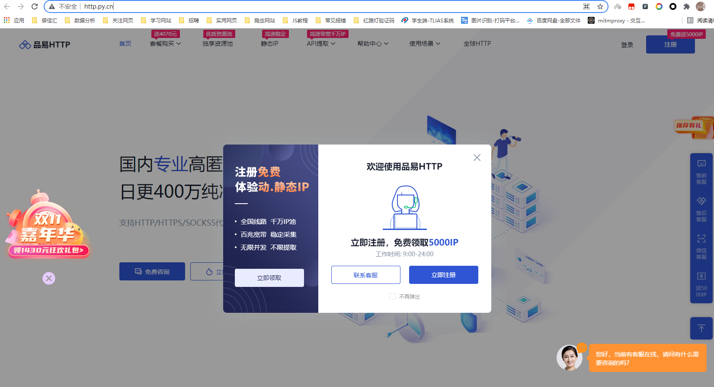

# 一、验证码的处理

## 1、验证码概述

### 1、2 什么是图片验证码？

* 验证码（CAPTCHA）是“Completely Automated Public Turing test to tell Computers and Humans Apart”（全自动区分计算机和人类的图灵测试）的缩写，是一种区分用户是计算机还是人的公共全自动程序。

### 1、2 验证码的作用

* 防止恶意破解密码、刷票、论坛灌水、刷页。有效防止某个黑客对某一个特定注册用户用特定程序暴力破解方式进行不断的登录尝试，实际上使用验证码是现在很多网站通行的方式（比如招商银行的网上个人银行，百度社区），我们利用比较简易的方式实现了这个功能。虽然登录麻烦一点，但是对网友的密码安全来说这个功能还是很有必要，也很重要。

### 1、3 图片验证码使用场景

* 注册
* 登录
* 频繁发送请求时，服务器弹出验证码进行验证

### 1、4 图片验证码的处理方案

* **手动输入(input):** 这种方法仅限于登录一次就可持续使用的情况
* **图像识别引擎解析:** 使用光学识别引擎处理图片中的数据，目前常用于图片数据提取，较少用于验证码处理
* **打码平台:** 爬虫常用的验证码解决方案

>对于验证码的处理， 我们今天主要学习通过打码平台去处理验证码

## 2、图片在网页页面中的形式

​		图片在网页页面中的形式一般就两种：一种是以一个连接形式存在html中，另外一种是以字符串的形式存在于html中。

* 以链接形式存在于html中的图片，意味着每次浏览器执行渲染的时候会发送图片链接地址请求，请求到了之后再渲染到页面。目前大部分网站都是以这种形式去加载图片的。之前我们也学习过通过获取图片的链接地址就可以请求图片数据。

  

  ​		这样的形式存在于页面当中的图片，如果一旦页面图片很多的话，就意味着需要发送很多次网络请求，去请求图片数据。

* 以字符串形式存在于html中的图片，和上述形式有明显的区别。这样形式的图片在html页面中是以字符串的形式去展示图片，而不是一个链接。

  

  ​		这样的好处是加载页面的时候，不用发送网络请求去请求图片数据。因为我们在请求html页面的时候就已经拿到图片的字符串数据，浏览器只需要转换图片为二进制形式展示就可以了。

  ​		有利也有弊，这样做虽然网络请求的次数少了，但是我们需要把图片转换成字符串形式才可以放到标签里面。如果图片数据过大，那么转换之后的字符长度就会很长。所以一般网页中字符串形式的图片都是数据量比较小的图片，比如验证码。

### 2、1 如何进行图片形式的转化

​		前面我们讲了图片有两种形式，链接形式的图片我们通过requests发送请求就可以拿到图片的二进制数据，保存下来就可以用看图软件查看。这种形式的图片处理就不做赘述了。

​		那么字符串的形式的图片我们应该如何处理呢？

​		字符串形式的图片我们可以借助 base64 模块进行处理。

* **base64.b64decode()**

  把字符串形式的图片转化为二进制的数据， 传入图片的字符串数据

* **base64.b64encode()**

  把二进制形式的图片转化为字符串数据， 传入图片的二进制数据

## 3、打码平台

​		现在很多网站都会使用验证码来进行反爬，所以为了能够更好的获取数据，需要了解如何使用打码平台破解爬虫中的验证码。

​		相比于复杂繁琐的验证码破解，打码平台能够给你快速的解决方案。今天我们就通过 快识别 验证码平台学习对接验证码平台识别验证码。

>目标网址：http://www.kuaishibie.cn/

### 3、1 价格体系

看打码平台首先应该了解就是价格体系，那是实实在在的真金白银。

* 快识别价格体系
  

​		相对于其他打码平台，**快识别**价格还是比较公道的。普通的验证码2厘钱一次，意味着普通验证码一元
可以打500次。

### 3、2 开发文档

​		每个打码平台既然给用户提供服务，那么就会提供一系列服务接口供用户使用。以及这些接口往往都会以开发文档的形式教用户怎么去使用。以下是快识别的开发文档：

>注意快识别开发文档在页面更新不及时，可以查看最新文档在线地址，地址在上图标红处。

开发文档中对应的有各个语言的示例接口，我们对应的选择python的示例接口自己去实现就好了。

# 二、代理的使用

## 2、1 付费代理

### 2、1、1 找付费代理服务站点

* 搜索`代理ip`，能够发现有很多付费代理服务站点

  

  ​		目前付费代理站点一般注册后，会有免费的测试代理用量，学习阶段用免费的做测试就够用了。不过现在代理网站普遍都需要实名认证，也会有站点的工作人员联系你添加联系方式，额外也会送你一些ip测试。

* 教学所用的代理服务网站是：**品易HTTP**，用其他网站的代理服务也可以，使用方法大同小异

  * 品易HTTP网址：https://http.py.cn?invitation_code=VS1dBikxZxwqdnsOY29HD0J+bmRKRQZaYjgPEXg6Dm4QQyplDhk=
  * 

  * 手机号注册，登录后实名认证，即可到账免费测试金额
    * 

### 2、1、2 生成获取代理的api接口

* 根据情况自选选项，生成获取代理的api接口。

### 2、1、3 python请求接口

* 请求接口示例

  ~~~python
  import requests
  
  
  def get_ip():
      response = requests.get(url='http://tiqu.pyhttp.taolop.com/getip?count=1&neek=13873&type=2&yys=0&port=1&sb=&mr=2&sep=0&pack=7406')
      ip_json = response.json()
      # print(ip_json)
  
      proxy = ip_json['data'][0]['ip'] + ':' + str(ip_json['data'][0]['port'])
      # print(proxy)
  
      proxies = {
          "http": "http://" + proxy,
          "https": "http://" + proxy,
      }
      return proxies
  ~~~

* 数据返回示例

  ~~~
  {'code': 0, 'data': [{'ip': '223.214.30.18', 'port': 64257}], 'msg': '0', 'success': True}
  ~~~

获取到代理ip后，即可在requests请求的时候，携带`proxies`关键字参数进行代理伪装的请求。

## 2、2 免费代理

​		网络上有大量免费且公开的代理可以供我们使用，但这些代理并不能保证都可以使用，因为同样的代理可能被其他人拿来爬虫使用而遭到封禁，因此，在真正使用之前，我们需要对这些免费代理进行筛选，剔除那些不能使用的。保留下可以用的，来构建一个代理池，供我们爬虫使用。

​		因此我们首先需要在网络中寻找免费的代理数据， 然后搭建一个代理服务去筛选可用的代理，通过链接接口的形式供爬虫项目去调用。

* 自建代理池

  此课程以录播的形式给大家讲解，所有课程资料都在以下网盘链接中， 请自行查看：

  * 链接: https://pan.baidu.com/s/1v7Zf6aMnRgc5HDEaNVqCUA
  * 提取码: hnph
  
  