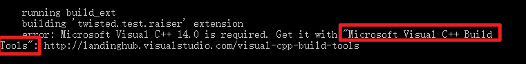

~~~
Scrapy是一个使用Python语言（基于Twisted框架）编写的开源网络爬虫框架，目前由Scrapinghub Ltd维护。Scrapy简单易用、灵活易拓展、开发社区活跃，并且是跨平台的。在Linux、 MacOS以及Windows平台都可以使用。 
~~~

## 1、scrapy简介

### 1、1 网络爬虫

​		网络爬虫是指在互联网上自动爬取网站内容信息的程序，也被称作网络蜘蛛或网络机器人。大型的爬虫程序被广泛应用于搜索引擎、数据挖掘等领域，个人用户或企业也可以利用爬虫收集对自身有价值的数据。

一个网络爬虫程序的基本执行流程可以总结三个过程：**请求数据**， **解析数据**， **保存数据** 

#### 1、1、1 请求数据

请求的数据除了普通的HTML之外，还有 json 数据、字符串数据、图片、视频、音频等。

#### 1、1、2 解析数据

当一个数据下载完成后，对数据中的内容进行分析，并提取出需要的数据，提取到的数据可以以多种形式保存起来，数据的格式有非常多种，常见的有csv、json、pickle等

#### 1、1、3 保存数据

​		最后将数据以某种格式（CSV、JSON）写入文件中，或存储到数据库（MySQL、MongoDB）中。同时保存为一种或者多种。

​		通常，我们想要获取的数据并不只在一个页面中，而是分布在多个页面中，这些页面彼此联系，一个页面中可能包含一个或多个到其他页面的链接，提取完当前页面中的数据后，还要把页面中的某些链接也提取出来，然后对链接页面进行爬取（循环1-3步骤）。

​		设计爬虫程序时，还要考虑防止重复爬取相同页面（URL去重）、网页搜索策略（深度优先或广度优先等）、爬虫访问边界限定等一系列问题。

​		从头开发一个爬虫程序是一项烦琐的工作，为了避免因制造轮子而消耗大量时间，在实际应用中我们可以选择使用一些优秀的爬虫框架，使用框架可以降低开发成本，提高程序质量，让我们能够专注于业务逻辑（爬取有价值的数据）。接下来，就带你学习目前非常流行的开源爬虫框架Scrapy。

### 1、2 scrapy安装

> scrapy官网： https://scrapy.org/
>
> scrapy中文文档：https://www.osgeo.cn/scrapy/intro/overview.html

#### 1、2、1 安装方式

在任意操作系统下，可以使用pip安装Scrapy，例如：

```python
$ pip install scrapy
```

* 更新模块的指令:

~~~python
# pip install --upgrade 模块名

# pip install --upgrade typing_extensions
~~~

安装完成后我们需要测试安装是否成功，通过如下步骤确认:

* 在 终端 中测试能否执行 scrapy 这条命令：

```python
Scrapy 2.4.0 - no active project

Usage:
  scrapy <command> [options] [args]

Available commands:
  bench				Run quick benchmark test
  fetch				Fetch a URL using the Scrapy downloader
  genspider			 Generate new spider using pre-defined templates
  runspider			 Run a self-contained spider (without creating a project)
  settings			 Get settings values
  shell				Interactive scraping console
  startproject		  Create new project
  version			 Print Scrapy version
  view				Open URL in browser, as seen by Scrapy

  [ more ]      More commands available when run from project directory

Use "scrapy <command> -h" to see more info about a command
```

* 输入 `scrapy bench` 测试连通性，如果出现以下情况表示安装成功：

  

  

通过了以上两项检测，说明Scrapy安装成功了。如上所示，我们安装的是当前最新版本2.4.0。

**注意：**

- 在安装Scrapy的过程中可能会遇到缺少VC++等错误，可以安装缺失模块的离线包



* 链接：https://pan.baidu.com/s/1IfcU8wi_5gkhW4YQwFemtA
  提取码：ga16

  下载 **Microsoft Visual C++ Build Tools.exe** 文件双击安装即可

- 成功安装后，在CMD下运行scrapy出现上图不算真正成功，检测真正是否成功使用`scrapy  bench`测试，如果没有提示错误，就代表成功安装。

具体Scrapy安装流程参考：**<http://doc.scrapy.org/en/latest/intro/install.html##intro-install-platform-notes> **里面有各个平台的安装方法

#### 1、2、2 全局命令

  ```shell
Scrapy 2.4.0 - no active project

Usage:
  scrapy <command> [options] [args]

Available commands:
  bench				Run quick benchmark test
  				   # 测试电脑性能
  fetch				Fetch a URL using the Scrapy downloader
  				   # 将源代码下载下来并显示出来
  genspider			 Generate new spider using pre-defined templates
  				   # 创建一个新的 spider 文件
  runspider			 Run a self-contained spider (without creating a project)
  				   # 这个和通过crawl启动爬虫不同，scrapy runspider 爬虫文件名称
  settings			 Get settings values
  				   # 获取当前的配置信息
  shell				Interactive scraping console
  				   # 进入 scrapy 的交互模式
  startproject		  Create new project
  					# 创建爬虫项目
  version			 Print Scrapy version
  					# 显示scrapy框架的版本
  view				Open URL in browser, as seen by Scrapy
  					# 将网页document内容下载下来，并且在浏览器显示出来

  [ more ]      More commands available when run from project directory

Use "scrapy <command> -h" to see more info about a command
  ```

**项目命令**

+ scrapy startproject projectname

  创建一个项目

- scrapy  genspider  spidername  domain

  创建爬虫。创建好爬虫项目以后，还需要创建爬虫。

- scrapy  crawl  spidername

  运行爬虫。注意该命令运行时所在的目录。

### 1、3 第一个scrapy爬虫

#### 1、3、1 项目需求 

在专门供爬虫初学者训练爬虫技术的网站（http://quotes.toscrape.com）上爬取名言警句。

#### 1、3、2 创建项目

在开始爬取之前，必须创建一个新的 Scrapy 项目。 进入您打算存储代码的目录中，运行下列命令:

```
(base) λ scrapy startproject quotes
New Scrapy project 'quotes', using template directory 'd:\anaconda3\lib\site-packages\scrapy\templates\project', created in:
    D:\课程-爬虫课程\02 框架爬虫\备课代码-框架爬虫\quotes

You can start your first spider with:
    cd quotes
    scrapy genspider example example.com

```

首先切换到新建的爬虫项目目录下，也就是 `/quotes` 目录下。然后执行创建爬虫文件的命令：

```
D:\课程-爬虫课程\02 框架爬虫\备课代码-框架爬虫 (master) 
(base) λ cd quotes\

D:\课程-爬虫课程\02 框架爬虫\备课代码-框架爬虫\quotes (master) 
(base) λ scrapy genspider quotes quotes.com
Cannot create a spider with the same name as your project

D:\课程-爬虫课程\02 框架爬虫\备课代码-框架爬虫\quotes (master) 
(base) λ scrapy genspider quote quotes.com
Created spider 'quote' using template 'basic' in module:
  quotes.spiders.quote
```

该命令将会创建包含下列内容的 `quotes` 目录:

```
 quotes
    │  items.py
    │  middlewares.py
    │  pipelines.py
    │  settings.py
    │  __init__.py
    │
    ├─spiders
       │  quote.py
       │  __init__.py
```

#### 1、3、3 robots.txt

​		robots协议也叫robots.txt（统一小写）是一种存放于[网站](https://baike.baidu.com/item/%E7%BD%91%E7%AB%99)根目录下的[ASCII](https://baike.baidu.com/item/ASCII)编码的文本文件，它通常告诉网络搜索引擎的网络蜘蛛，此网站中的哪些内容是不应被搜索引擎的爬虫获取的，哪些是可以被爬虫获取的。

robots 协议并不是一个规范，而只是约定俗成的。

```python
# filename:settings.py

# Obey robots.txt rules
ROBOTSTXT_OBEY = False
```

#### 1、3、4 分析页面 

编写爬虫程序之前，首先需要对待爬取的页面进行分析，主流的浏览器中都带有分析页面的工具或插件，这里我们选用Chrome浏览器的开发者工具（Tools→Developer tools）分析页面。

**1．数据信息**

在Chrome浏览器中打开页面http://quotes.toscrape.com，然后选择“Elements”，查看其HTML代码。

可以看到每一个标签都包裹在 <div class="quote"> 标签中


#### 1、3、5 编写spider

分析完页面后，接下来编写爬虫。在Scrapy中编写一个爬虫，在 scrapy.Spider 中编写代码

Spider 是用户编写用于从单个网站(或者一些网站)爬取数据的类。

其包含了一个用于下载的初始URL，如何跟进网页中的链接以及如何分析页面中的内容， 提取生成 item 的方法。

为了创建一个Spider，您必须继承 scrapy.Spider 类， 且定义以下三个属性:

- **name:** 用于区别Spider。 该名字必须是唯一的，您不可以为不同的Spider设定相同的名字。
- **start_urls:** 包含了Spider在启动时进行爬取的url列表。 因此，第一个被获取到的页面将是其中之一。 后续的URL则从初始的URL获取到的数据中提取。
- **parse()：** 是 spider 的一个方法。 被调用时，每个初始URL完成下载后生成的 Response 对象将会作为唯一的参数传递给该函数。 该方法负责解析返回的数据(response data)，提取数据(生成item)以及生成需要进一步处理的URL的 Request 对象。

```python
import scrapy


class QuoteSpider(scrapy.Spider):
    name = 'quote'
    allowed_domains = ['quotes.com']
    start_urls = ['http://quotes.toscrape.com/']

    def parse(self, response):
        pass

```

下面对 quote 的实现做简单说明。

**重点：**

* `scrapy.Spider`：爬虫基类，每个其他的spider必须继承自该类(包括Scrapy自带的其他spider以及您自己编写的spider)。

* `name`是爬虫的名字，是在`genspider`的时候指定的。

- `allowed_domains` 是爬虫能抓取的域名，爬虫只能在这个域名下抓取网页，可以不写。

- `start_urls` 是Scrapy抓取的网站，是可迭代类型，当然如果有多个网页，列表中写入多个网址即可，常用列表推导式的形式。

- `parse` 称为回调函数，该方法中的response就是`start_urls`网址发出请求后得到的响应。当然也可以指定其他函数来接收响应。一个页面解析函数通常需要完成以下两个任务：

  - 提取页面中的数据（re、XPath、CSS选择器）
  - 提取页面中的链接，并产生对链接页面的下载请求。

  页面解析函数通常被实现成一个生成器函数，每一项从页面中提取的数据以及每一个对链接页面的下载请求都由yield语句提交给Scrapy引擎。

#### 1、3、6 解析数据

```python
import scrapy

...
    def parse(self, response):
        quotes = response.css('.quote')
        for quote in quotes:
            text = quote.css('.text::text').extract_first()
            auth = quote.css('.author::text').extract_first()
            tages = quote.css('.tags a::text').extract()
            yield dict(text=text, auth=auth, tages=tages)

```

**重点：**

* `response.css()`直接使用css语法即可提取响应中的数据。

- `start_urls`中可以写多个网址，以列表格式分割开即可。

* `extract()`是提取css对象中的数据，提取出来以后是列表，否则是个对象。并且对于`extract_first()` 是提取第一个

#### 1、3、7 运行爬虫 

在 `/quotes` 目录下运行`scrapy  crawl  quotes` 即可运行爬虫项目。

**运行爬虫之后发生了什么？**

Scrapy 为 Spider的 `start_urls` 属性中的每个URL创建了 scrapy.Request 对象，并将 parse 方法作为回调函数(callback)赋值给了Request。

Request对象经过调度，执行生成 scrapy.http.Response 对象并送回给 spider parse() 方法进行处理。

完成代码后，运行爬虫爬取数据，在shell中执行scrapy crawl &lt;SPIDER\_NAME&gt;命令运行爬虫'quote'，并将爬取的数据存储到csv文件中：

```
(base) λ scrapy crawl quote -o quotes.csv
2020-01-08 20:48:44 [scrapy.utils.log] INFO: Scrapy 1.8.0 started (bot: quotes)
....
```

等待爬虫运行结束后，就会在当前目录下生成一个 quotes.csv 的文件，里面的数据已 csv 格式存放。

`-o` 支持保存为多种格式。保存方式也非常简单，只要给上文件的后缀名就可以了。（csv、json、pickle等）

## 2、Scrapy 框架结构

**思考** 

+ scrapy 为什么是框架而不是库？
+ scrapy 是如何工作的？

### 2、1 项目结构

在开始爬取之前，必须创建一个新的 Scrapy 项目。 进入您打算存储代码的目录中，运行下列命令:

> 注意：创建项目时，会在当前目录下新建爬虫项目的目录。

这些文件分别是:

- `scrapy.cfg`: 项目的配置文件
- `quotes/`: 该项目的python模块。之后您将在此加入代码
- `quotes/items.py`: 项目中的item文件
- `quotes/middlewares.py`: 爬虫中间件、下载中间件（处理请求体与响应体）
- `quotes/pipelines.py`: 项目中的pipelines文件
- `quotes/settings.py`: 项目的设置文件
- `quotes/spiders/`: 放置spider代码的目录

**Scrapy原理图** 


### 2、1 各个组件的介绍

1. **Engine**。引擎,处理整个系统的数据流处理、触发事务,是整个框架的核心。

2. **Item**。项目,它定义了爬取结果的数据结构,爬取的数据会被赋值成该Item对象。

3. **Scheduler**。调度器,接受引擎发过来的请求并将其加入队列中,在引擎再次请求的时候将请求提供给引擎。

4. **Downloader**。下载器,下载网页内容,并将网页内容返回给蜘蛛。

5. **Spiders**。 蜘蛛,其内定义了爬取的逻辑和网页的解析规则,它主要负责解析响应并生成提结果和新的请求。

6. **Item Pipeline**。项目管道,负责处理由蜘蛛从网页中抽取的项目,它的主要任务是清洗、验证和存储数据。

7. **Downloader Middlewares**。下载器中间件,位于引擎和下载器之间的钩子框架,主要处理引擎与下载器之间的请求及响应。

8. **Spider Middlewares**。 蜘蛛中间件,位于引擎和蜘蛛之间的钩子框架,主要处理蜘蛛输入的响应和输出的结果及新的请求。


### 2、2 数据的流动

- Scrapy Engine(引擎): 负责Spider、ItemPipeline、Downloader、Scheduler中间的通讯，信号、数据传递等。
- Scheduler(调度器): 负责接受引擎发送过来的Request请求，并按照一定的方式进行整理排列，入队，当引擎需要时，交还给引擎。
- Downloader(下载器)：负责下载Scrapy Engine(引擎)发送的所有Requests请求，并将其获取到的Responses交还给Scrapy Engine(引擎)，由引擎交给Spider来处理，
- Spider（爬虫）：负责处理所有Responses,从中分析提取数据，获取Item字段需要的数据，并将需要跟进的URL提交给引擎，再次进入Scheduler(调度器)，
- Item Pipeline(管道)：负责处理Spider中获取到的Item，并进行进行后期处理（详细分析、过滤、存储等）的地方.
- Downloader Middlewares(下载中间件)：你可以当作是一个可以自定义扩展下载功能的组件。
- Spider Middlewares(Spider中间件)：你可以理解为是一个可以自定扩展和操作引擎和Spider中间通信的功能组件（比如进入Spider的Responses;和从Spider出去的Requests）

## 3、scrapy.Spider

Spider 类定义了如何爬取某个(或某些)网站。包括了爬取的动作(例如:是否跟进链接)以及如何从网页的内容中提取结构化数据(爬取item)。 换句话说，Spider就是您定义爬取的动作及分析某个网页(或者是有些网页)的地方。

对spider来说，爬取的循环类似下文:

1. 以初始的URL初始化Request，并设置回调函数。 当该request下载完毕并返回时，将生成response，并作为参数传给该回调函数。

   spider中初始的request是通过调用 start_requests()来获取的。 start_requests() 读取 start_urls 中的URL， 并以 parse 为回调函数生成 Request。

2. 在回调函数内分析返回的(网页)内容，返回 Item 对象或者 Request 或者一个包括二者的可迭代容器。 返回的Request对象之后会经过Scrapy处理，下载相应的内容，并调用设置的callback函数(函数可相同)。

3. 在回调函数内，您可以使用 [选择器(Selectors)](https://scrapy-chs.readthedocs.io/zh_CN/latest/topics/selectors.html##topics-selectors) (您也可以使用BeautifulSoup, lxml 或者您想用的任何解析器) 来分析网页内容，并根据分析的数据生成item。

4. 最后，由spider返回的item将被存到数据库(由某些 Item Pipeline处理)或使用 Feed exports存入到文件中。

虽然该循环对任何类型的spider都(多少)适用，但Scrapy仍然为了不同的需求提供了多种默认spider。 之后将讨论这些spider。

### 3、1 Spider

scrapy.spider.Spider 是最简单的spider。每个其他的spider必须继承自该类(包括Scrapy自带的其他spider以及您自己编写的spider)。 其仅仅请求给定的 start_urls / start_requests ，并根据返回的结果(resulting responses)调用 spider 的 parse 方法。

#### name

定义 spider 名字的字符串(string)。spider 的名字定义了 Scrapy 如何定位(并初始化) spider ，所以其必须是唯一的。 不过您可以生成多个相同的 spider 实例(instance)，这没有任何限制。 name 是 spider 最重要的属性，而且是必须的。

如果该 spider 爬取单个网站(single domain)，一个常见的做法是以该网站(domain)(加或不加后缀 )来命名 spider 。 例如，如果 spider 爬取 `mywebsite.com` ，该spider通常会被命名为 `mywebsite` 。

#### allowed_domains

可选。包含了spider允许爬取的域名(domain)列表(list)。 当 OffsiteMiddleware 启用时， 域名不在列表中的URL不会被跟进。

#### start_urls

URL 列表。当没有制定特定的 URL 时，spider 将从该列表中开始进行爬取。 因此，第一个被获取到的页面的 URL 将是该列表之一。 后续的 URL 将会从获取到的数据中提取。

#### start_requests()

该方法必须返回一个可迭代对象(iterable)。该对象包含了spider用于爬取的第一个 Request。

当 spider 启动爬取并且未制定 URL 时，该方法被调用。 当指定了URL时，make_requests_from_url() 将被调用来创建 Request 对象。 该方法仅仅会被 Scrapy 调用一次，因此您可以将其实现为生成器。

该方法的默认实现是使用 start_urls 的url生成 Request。

如果您想要修改最初爬取某个网站的Request对象，您可以重写(override)该方法。 例如，如果您需要在启动时以 POST 登录某个网站，你可以这么写:

```python
def start_requests(self):
    return [scrapy.FormRequest("http://www.example.com/login",
                               formdata={'user': 'john', 'pass': 'secret'},
                               callback=self.logged_in)]

def logged_in(self, response):
    ## here you would extract links to follow and return Requests for
    ## each of them, with another callback
    pass
```

#### parse

当response没有指定回调函数时，该方法是Scrapy处理下载的response的默认方法。

`parse` 负责处理response并返回处理的数据以及(/或)跟进的URL。 Spider 对其他的Request的回调函数也有相同的要求。

该方法及其他的Request回调函数必须返回一个包含 Request 及(或) Item 的可迭代的对象。

参数: response– 用于分析的response 

### 3、2 启动方式

#### 3、2、1 start_urls

start_urls 是一个列表

#### 3、2、2 start_requests

使用`start_requests()` 重写`start_urls`，要使用`Request()`方法自己发送请求：

```python
    def start_requests(self):
        """重写 start_urls 规则"""
        yield scrapy.Request(url='http://quotes.toscrape.com/page/1/', callback=self.parse)
```

#### 3、2、3 scrapy.Request

scrapy.Request 是一个请求对象，创建时必须制定回调函数。

#### 3、2、4 数据保存

可以使用 -o 将数据保存为常见的格式（根据后缀名保存）

支持的格式有下面几种：

+ json
+ jsonlines
+ jl
+ csv
+ xml
+ marshal
+ pickle

使用方式：

 ```
scrapy crawl quotes2 -o a.json
 ```

#### 案例：Spider 样例

让我们来看一个例子:

```python
## -*- coding: utf-8 -*-
import scrapy


class Quotes2Spider(scrapy.Spider):
    name = 'quotes2'
    allowed_domains = ['toscrape.com']
    start_urls = ['http://quotes.toscrape.com/page/2/']

    def parse(self, response):
        quotes = response.css('.quote')
        for quote in quotes:
            text = quote.css('.text::text').extract_first()
            auth = quote.css('.author::text').extract_first()
            tages = quote.css('.tags a::text').extract()
            yield dict(text=text,auth=auth,tages=tages)

```

## 4、Item

​		`Item`是保存爬取数据的容器,它的使用方法和字典类似。不过,相比字典,`Item`提供了额外的保护机制,可以避免拼写错误或者定义字段错误。

​		创建`Item`需要继承`scrapy.Item`类,并且定义类型为`scrapy.Field`的字段。在创建项目开始的时候`Item`文件是这样的。

```python
import scrapy

class TutorialItem(scrapy.Item):
    # define the fields for your item here like:
    # 参照下面这个参数定义你的字段
    # name = scrapy.Field()
    pass

```

​		在保存数据的时候可以每次初始化一个字典等格式，但是最方便，最好的保存方式就是使用 Scrapy 自带的 Item 数据结构了。

我们学习了从页面中提取数据的方法，接下来学习如何封装爬取到的数据。应该用怎样的数据结构来维护这些零散的信息字段呢？最容易想到是使用Python字典（dict）。

回顾之前的代码

```python
class QuotesSpider(scrapy.Spider):
    name = 'quotes'
    allowed_domains = ['toscrape.com']
    start_urls = ['http://quotes.toscrape.com/']

    def parse(self, response):
        quotes = response.css('.quote')

        for quote in quotes:
            text = quote.css('.text::text').get()
            author = quote.css('.author::text').get()
            tags = quote.css('.tag::text').getall()

            yield {
                'text': text,
                'author': author,
                'tags': tags,
            }
```

在该案例中，我们便使用了Python字典存储一条数据的信息，但字典可能有以下缺点：

（1）无法一目了然地了解数据中包含哪些字段，影响代码可读性。

（2）缺乏对字段名字的检测，容易因程序员的笔误而出错。

（3）不便于携带元数据（传递给其他组件的信息）。

为解决上述问题，在Scrapy中可以使用自定义的Item类封装爬取到的数据。

### 4、1 Item 和 Field 

Scrapy提供了以下两个类，用户可以使用它们自定义数据类（如书籍信息），封装爬取到的数据：

#### 4、1、1 Item 基类

数据结构的基类，在items.py中定义数据结构时，需要继承自该基类。

#### 4、1、2 Field 类

用来描述自定义数据类包含哪些字段（如name、price等）。

自定义一个数据类，只需继承Item，并创建一系列Field对象的类属性即可。

以定义书籍信息 quote 为例，它包含个字段，分别为书的名字text、author和tags，代码如下：

```python
# 特殊的字典结构 可以在scrapy中传递数据
class TutorialItem(scrapy.Item):
    # Field 字段
    # 就是类似于产生一个类似字典格式的数据  拥有字典的一些属性
    # 字段默认为空
    # 我们可以通过实例化 像着键赋值 但是如果没有写这个键 就不能赋值 但是字典可以
    text = scrapy.Field()
    author = scrapy.Field()
    tags = scrapy.Field()
```

Item支持字典接口，因此 TutorialItem 在使用上和Python字典类似。

对字段进行赋值时，TutorialItem 内部会对字段名进行检测，如果赋值一个没有定义的字段，就会抛出异常（防止因用户粗心而导致错误）

## 5、 scrapy.Request

> Request 和 Response 对象，用于爬网网站。 

Request对象用来描述一个HTTP请求，下面是其构造器方法的参数列表：

```
Request(url, callback=None, method='GET', headers=None, body=None,
        cookies=None, meta=None, encoding='utf-8', priority=0,
        dont_filter=False, errback=None, flags=None, cb_kwargs=None)
```

- **url**（*字符串*）–此请求的URL
- **callback**（*callable*）–将以请求的响应（一旦下载）作为第一个参数调用的函数。有关更多信息，请参见下面的将其他数据传递给回调函数。如果“请求”未指定回调，parse() 则将使用“Spider” 方法。请注意，如果在处理过程中引发异常，则会调用errback。
- **method**（*字符串*）–此请求的HTTP方法。默认为`'GET'`。
- **meta**（dict）– Request.meta属性的初始值。如果给出，则在此参数中传递的字典将被浅表复制。
- **headers**（dict）–请求头。dict值可以是字符串（对于单值标头）或列表（对于多值标头）。如果 `None`作为值传递，则将根本不发送HTTP标头。

```python
class QuotesSpider(scrapy.Spider):
    name = 'quotes_3'

    allowed_domains = ['toscrape.com']

    start_urls = ['http://quotes.toscrape.com/']


    def parse(self, response):
        quotes = response.css('.quote')

        for quote in quotes:
            text = quote.css('.text::text').get()
            author = quote.css('.author::text').get()
            tags = quote.css('.tag::text').getall()
            yield Qd01QuotesItem(text=text, author=author, tags=tags)

            next_page = response.css('.next a::attr(href)').get()
            if next_page:                                                       
                next_url = 'http://quotes.toscrape.com' + next_page
                yield scrapy.Request(next_url, callback=self.parse)
```

