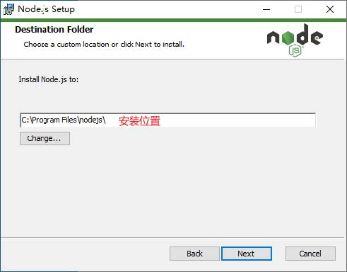
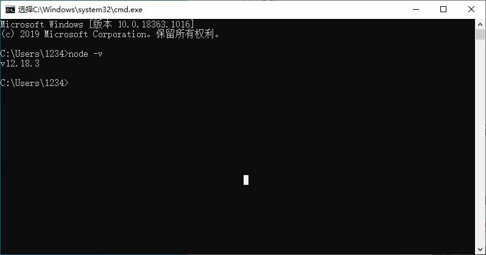
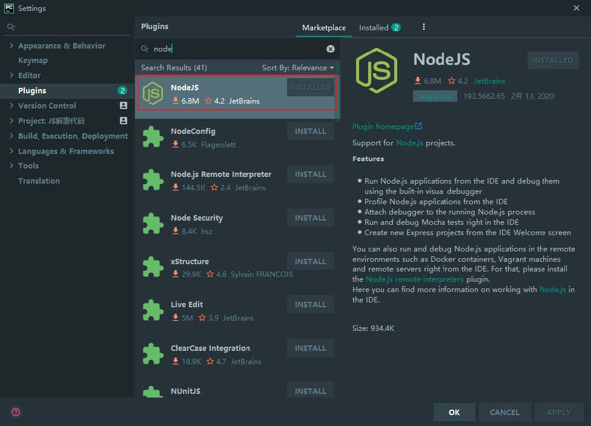
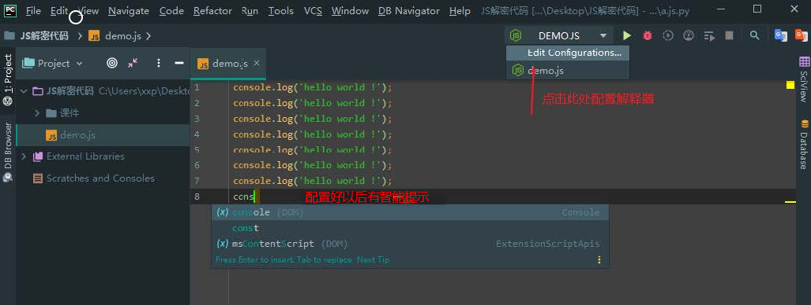
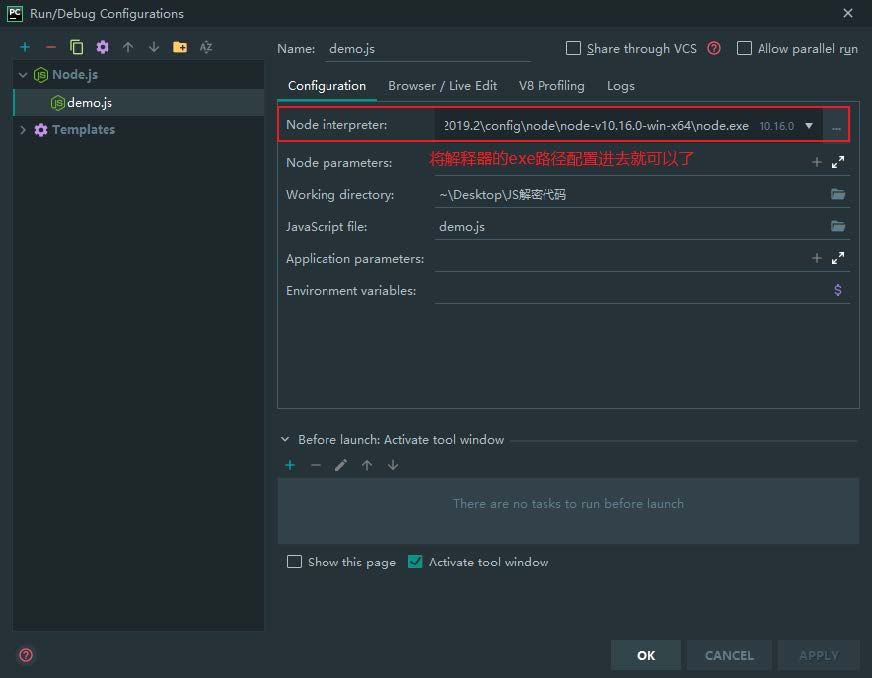

>今天我们学习 js 解密的入门知识，让大家体验一下js解密究竟是什么样的。

## 1、JavaScript

### 1、1 JavaScript 是什么

* JavaScript 是世界上最流行的语言之一，是一种运行在客户端的脚本语言 （Script 是脚本的意思）
* 脚本语言：不需要编译，运行过程中由 js 解释器( js 引擎）逐行来进行解释并执行
* 现在也可以基于 Node.js 技术进行服务器端编程

## 2、安装 JavaScript 解释器

​		既然JavaScript是一门计算机语言，那么和python一样，需要配置解释器环境。JavaScript解密也需要依赖解释器运行JavaScript代码。

### 2、1 下载安装包

Node.js 官方网站下载：https://nodejs.org/en/

### 2、2 安装

打开安装，下一步下一步即可：

### 2、3 测试安装结果

最后在cmd命令窗口下，输入 node -v 即可查看node的安装版本，如果输入没有效果，则是因为没有
配置到环境变量，需要手动配置一下。

### 2、4 安装 pycharm 插件

​		在进行 JavaScript 解密时，需要一个JavaScript代码调试工具，这里我们直接在现成的专业版里面安装node插件，就可以使用pycharm 直接调试js代码了。

* 先下载安装NodeJS插件，直接在pligins里面搜索Node就能找到，然后点击安装

* 安装好了之后，重启Pycharm，等待片刻之后，就会提示js解释器不能使用，需要自己进行配置。

## 3、python调用JavaScript代码

​		如果想用python代码直接调用js的代码，则需要搭建js环境，并安装相关的库直接调用JS代码。**PyExecJS**就是其中一个比较好的库。可以使用 python 运行 JavaScript 代码。

但是这个库已经不再维护了，如果因为版本更新所导致的一些错误是无法修复的。

* PyExecJS 的优点是不需要关心 JavaScript 环境。 特别是它可以在 Windows 环境下工作，而不需要安装额外的库。
* 缺点之一是性能。 通过文本传递 JavaScript 运行时，速度很慢。 另一个缺点是它不完全支持运行时特定的特性。

**安装**

先安装`nodejs`环境，在安装 python 库。

~~~
pip install pyexecjs
~~~

**使用**

* execjs.compile()

  编译js，括号内部传js的语法

* obj.call()
  调用js方法，obj表示编译好的js对象，call方法内部传js中需要调用的函数，和调用函数所需参数。

## 案例-百度翻译js解密

~~~javascript

function n(r, o) {
    for (var t = 0; t < o.length - 2; t += 3) {
        var a = o.charAt(t + 2);
        a = a >= "a" ? a.charCodeAt(0) - 87 : Number(a),
            a = "+" === o.charAt(t + 1) ? r >>> a : r << a,
            r = "+" === o.charAt(t) ? r + a & 4294967295 : r ^ a
    }
    return r
}

var i = '320305.131321201';

function e(r) {
    var o = r.match(/[\uD800-\uDBFF][\uDC00-\uDFFF]/g);
    if (null === o) {
        var t = r.length;
        t > 30 && (r = "" + r.substr(0, 10) + r.substr(Math.floor(t / 2) - 5, 10) + r.substr(-10, 10))
    } else {
        for (var e = r.split(/[\uD800-\uDBFF][\uDC00-\uDFFF]/), C = 0, h = e.length, f = []; h > C; C++)
            "" !== e[C] && f.push.apply(f, a(e[C].split(""))),
            C !== h - 1 && f.push(o[C]);
        var g = f.length;
        g > 30 && (r = f.slice(0, 10).join("") + f.slice(Math.floor(g / 2) - 5, Math.floor(g / 2) + 5).join("") + f.slice(-10).join(""))
    }
    var u = void 0
      , l = "" + String.fromCharCode(103) + String.fromCharCode(116) + String.fromCharCode(107);
    u = null !== i ? i : (i = window[l] || "") || "";
    for (var d = u.split("."), m = Number(d[0]) || 0, s = Number(d[1]) || 0, S = [], c = 0, v = 0; v < r.length; v++) {
        var A = r.charCodeAt(v);
        128 > A ? S[c++] = A : (2048 > A ? S[c++] = A >> 6 | 192 : (55296 === (64512 & A) && v + 1 < r.length && 56320 === (64512 & r.charCodeAt(v + 1)) ? (A = 65536 + ((1023 & A) << 10) + (1023 & r.charCodeAt(++v)),
        S[c++] = A >> 18 | 240,
        S[c++] = A >> 12 & 63 | 128) : S[c++] = A >> 12 | 224,
        S[c++] = A >> 6 & 63 | 128),
        S[c++] = 63 & A | 128)
    }
    for (var p = m, F = "" + String.fromCharCode(43) + String.fromCharCode(45) + String.fromCharCode(97) + ("" + String.fromCharCode(94) + String.fromCharCode(43) + String.fromCharCode(54)), D = "" + String.fromCharCode(43) + String.fromCharCode(45) + String.fromCharCode(51) + ("" + String.fromCharCode(94) + String.fromCharCode(43) + String.fromCharCode(98)) + ("" + String.fromCharCode(43) + String.fromCharCode(45) + String.fromCharCode(102)), b = 0; b < S.length; b++)
        p += S[b], 
        p = n(p, F);
    return p = n(p, D),
    p ^= s, 
    0 > p && (p = (2147483647 & p) + 2147483648),
    p %= 1e6,
    p.toString() + "." + (p ^ m)
} 
~~~

## 案例-有道翻译js解密

~~~javascript

var n = function (e, t) {
    return e << t | e >>> 32 - t
}
    , r = function (e, t) {
    var n, r, i, a, o;
    return i = 2147483648 & e,
        a = 2147483648 & t,
        n = 1073741824 & e,
        r = 1073741824 & t,
        o = (1073741823 & e) + (1073741823 & t),
        n & r ? 2147483648 ^ o ^ i ^ a : n | r ? 1073741824 & o ? 3221225472 ^ o ^ i ^ a : 1073741824 ^ o ^ i ^ a : o ^ i ^ a
}
    , i = function (e, t, n) {
    return e & t | ~e & n
}
    , a = function (e, t, n) {
    return e & n | t & ~n
}
    , o = function (e, t, n) {
    return e ^ t ^ n
}
    , s = function (e, t, n) {
    return t ^ (e | ~n)
} 
    , l = function (e, t, a, o, s, l, c) {
    return e = r(e, r(r(i(t, a, o), s), c)),
        r(n(e, l), t)
}
    , c = function (e, t, i, o, s, l, c) {
    return e = r(e, r(r(a(t, i, o), s), c)),
        r(n(e, l), t)
}
    , u = function (e, t, i, a, s, l, c) {
    return e = r(e, r(r(o(t, i, a), s), c)),
        r(n(e, l), t)
}
    , d = function (e, t, i, a, o, l, c) {
    return e = r(e, r(r(s(t, i, a), o), c)),
        r(n(e, l), t)
}
    , f = function (e) {
    for (var t, n = e.length, r = n + 8, i = 16 * ((r - r % 64) / 64 + 1), a = Array(i - 1), o = 0, s = 0; s < n;)
        o = s % 4 * 8,
            a[t = (s - s % 4) / 4] = a[t] | e.charCodeAt(s) << o,
            s++;
    return t = (s - s % 4) / 4,
        o = s % 4 * 8,
        a[t] = a[t] | 128 << o,
        a[i - 2] = n << 3,
        a[i - 1] = n >>> 29,
        a
}
    , p = function (e) {
    var t, n = "", r = "";
    for (t = 0; t <= 3; t++)
        n += (r = "0" + (e >>> 8 * t & 255).toString(16)).substr(r.length - 2, 2);
    return n
}
    , h = function (e) {
    e = e.replace(/\x0d\x0a/g, "\n");
    for (var t = "", n = 0; n < e.length; n++) {
        var r = e.charCodeAt(n);
        if (r < 128)
            t += String.fromCharCode(r);
        else if (r > 127 && r < 2048)
            t += String.fromCharCode(r >> 6 | 192),
                t += String.fromCharCode(63 & r | 128);
        else if (r >= 55296 && r <= 56319) {
            if (n + 1 < e.length) {
                var i = e.charCodeAt(n + 1);
                if (i >= 56320 && i <= 57343) {
                    var a = 1024 * (r - 55296) + (i - 56320) + 65536;
                    t += String.fromCharCode(240 | a >> 18 & 7),
                        t += String.fromCharCode(128 | a >> 12 & 63),
                        t += String.fromCharCode(128 | a >> 6 & 63),
                        t += String.fromCharCode(128 | 63 & a),
                        n++
                }
            }
        } else
            t += String.fromCharCode(r >> 12 | 224),
                t += String.fromCharCode(r >> 6 & 63 | 128),
                t += String.fromCharCode(63 & r | 128)
    }
    return t
};

var navigator = {"appVersion": "5.0 (Windows NT 10.0; Win64; x64) AppleWebKit/537.36 (KHTML, like Gecko) Chrome/87.0.4280.88 Safari/537.36"};

md5 = function (e) {
    var t, n, i, a, o, s, m, g, v, y = Array();
    for (e = h(e),
         y = f(e),
         s = 1732584193,
         m = 4023233417,
         g = 2562383102,
         v = 271733878,
         t = 0; t < y.length; t += 16)
        n = s,
            i = m,
            a = g,
            o = v,
            s = l(s, m, g, v, y[t + 0], 7, 3614090360),
            v = l(v, s, m, g, y[t + 1], 12, 3905402710),
            g = l(g, v, s, m, y[t + 2], 17, 606105819),
            m = l(m, g, v, s, y[t + 3], 22, 3250441966),
            s = l(s, m, g, v, y[t + 4], 7, 4118548399),
            v = l(v, s, m, g, y[t + 5], 12, 1200080426),
            g = l(g, v, s, m, y[t + 6], 17, 2821735955),
            m = l(m, g, v, s, y[t + 7], 22, 4249261313),
            s = l(s, m, g, v, y[t + 8], 7, 1770035416),
            v = l(v, s, m, g, y[t + 9], 12, 2336552879),
            g = l(g, v, s, m, y[t + 10], 17, 4294925233),
            m = l(m, g, v, s, y[t + 11], 22, 2304563134),
            s = l(s, m, g, v, y[t + 12], 7, 1804603682),
            v = l(v, s, m, g, y[t + 13], 12, 4254626195),
            g = l(g, v, s, m, y[t + 14], 17, 2792965006),
            m = l(m, g, v, s, y[t + 15], 22, 1236535329),
            s = c(s, m, g, v, y[t + 1], 5, 4129170786),
            v = c(v, s, m, g, y[t + 6], 9, 3225465664),
            g = c(g, v, s, m, y[t + 11], 14, 643717713),
            m = c(m, g, v, s, y[t + 0], 20, 3921069994),
            s = c(s, m, g, v, y[t + 5], 5, 3593408605),
            v = c(v, s, m, g, y[t + 10], 9, 38016083),
            g = c(g, v, s, m, y[t + 15], 14, 3634488961),
            m = c(m, g, v, s, y[t + 4], 20, 3889429448),
            s = c(s, m, g, v, y[t + 9], 5, 568446438),
            v = c(v, s, m, g, y[t + 14], 9, 3275163606),
            g = c(g, v, s, m, y[t + 3], 14, 4107603335),
            m = c(m, g, v, s, y[t + 8], 20, 1163531501),
            s = c(s, m, g, v, y[t + 13], 5, 2850285829),
            v = c(v, s, m, g, y[t + 2], 9, 4243563512),
            g = c(g, v, s, m, y[t + 7], 14, 1735328473),
            m = c(m, g, v, s, y[t + 12], 20, 2368359562),
            s = u(s, m, g, v, y[t + 5], 4, 4294588738),
            v = u(v, s, m, g, y[t + 8], 11, 2272392833),
            g = u(g, v, s, m, y[t + 11], 16, 1839030562),
            m = u(m, g, v, s, y[t + 14], 23, 4259657740),
            s = u(s, m, g, v, y[t + 1], 4, 2763975236),
            v = u(v, s, m, g, y[t + 4], 11, 1272893353),
            g = u(g, v, s, m, y[t + 7], 16, 4139469664),
            m = u(m, g, v, s, y[t + 10], 23, 3200236656),
            s = u(s, m, g, v, y[t + 13], 4, 681279174),
            v = u(v, s, m, g, y[t + 0], 11, 3936430074),
            g = u(g, v, s, m, y[t + 3], 16, 3572445317),
            m = u(m, g, v, s, y[t + 6], 23, 76029189),
            s = u(s, m, g, v, y[t + 9], 4, 3654602809),
            v = u(v, s, m, g, y[t + 12], 11, 3873151461),
            g = u(g, v, s, m, y[t + 15], 16, 530742520),
            m = u(m, g, v, s, y[t + 2], 23, 3299628645),
            s = d(s, m, g, v, y[t + 0], 6, 4096336452),
            v = d(v, s, m, g, y[t + 7], 10, 1126891415),
            g = d(g, v, s, m, y[t + 14], 15, 2878612391),
            m = d(m, g, v, s, y[t + 5], 21, 4237533241),
            s = d(s, m, g, v, y[t + 12], 6, 1700485571),
            v = d(v, s, m, g, y[t + 3], 10, 2399980690),
            g = d(g, v, s, m, y[t + 10], 15, 4293915773),
            m = d(m, g, v, s, y[t + 1], 21, 2240044497),
            s = d(s, m, g, v, y[t + 8], 6, 1873313359),
            v = d(v, s, m, g, y[t + 15], 10, 4264355552),
            g = d(g, v, s, m, y[t + 6], 15, 2734768916),
            m = d(m, g, v, s, y[t + 13], 21, 1309151649),
            s = d(s, m, g, v, y[t + 4], 6, 4149444226),
            v = d(v, s, m, g, y[t + 11], 10, 3174756917),
            g = d(g, v, s, m, y[t + 2], 15, 718787259),
            m = d(m, g, v, s, y[t + 9], 21, 3951481745),
            s = r(s, n),
            m = r(m, i),
            g = r(g, a),
            v = r(v, o);
    return (p(s) + p(m) + p(g) + p(v)).toLowerCase()
}

var youdao = function (e) {
    var t = md5(navigator.appVersion)
        , r = "" + (new Date).getTime()
        , i = r + parseInt(10 * Math.random(), 10);
    return {
        ts: r,
        bv: t,
        salt: i,
        sign: md5("fanyideskweb" + e + i + "Tbh5E8=q6U3EXe+&L[4c@")
    }
};
~~~

## js学习网站

~~~PYTHON
https://wangdoc.com/javascript/   # ES5
~~~

